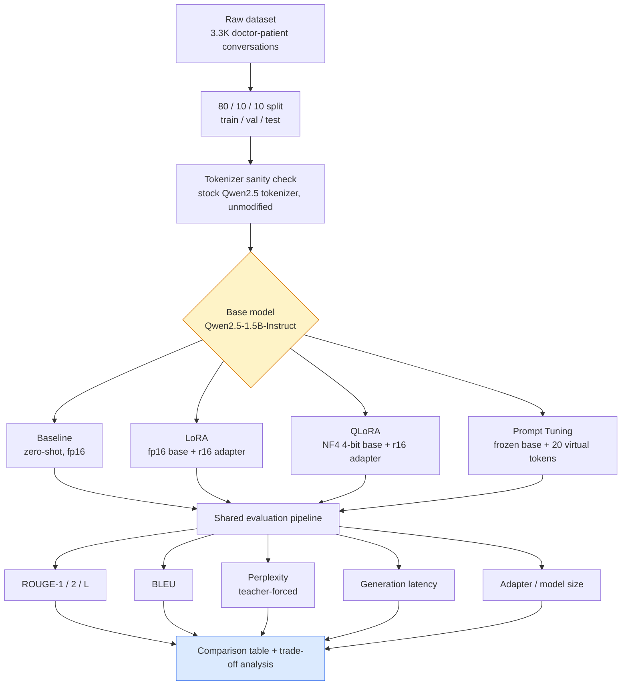
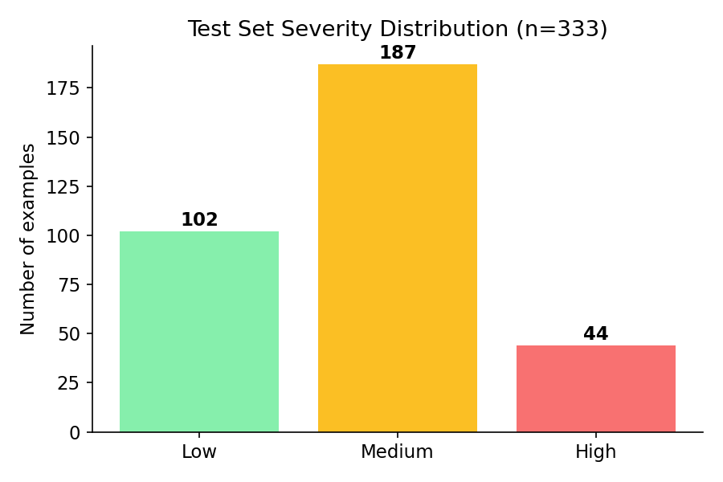
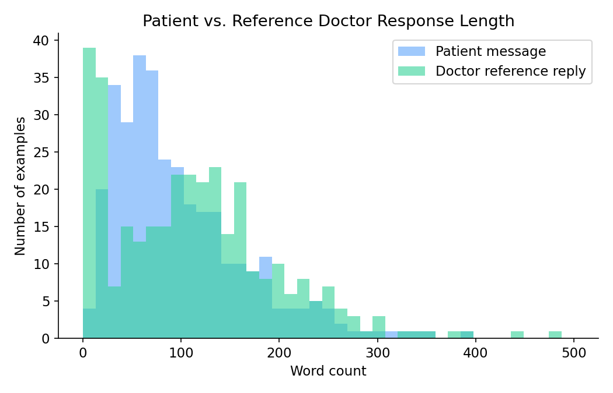
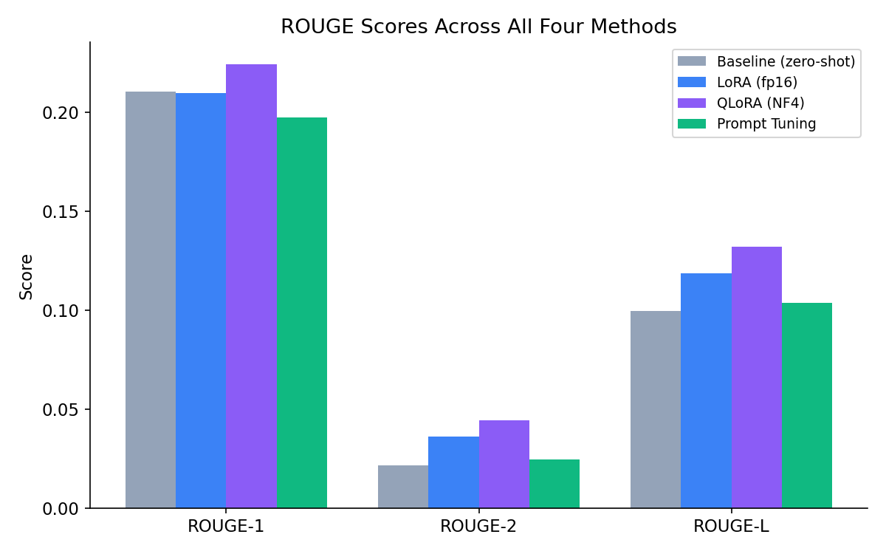
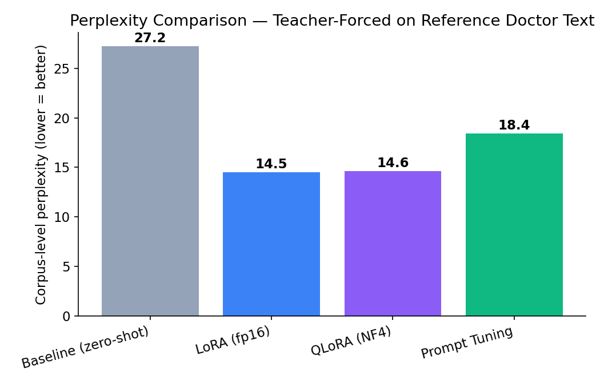
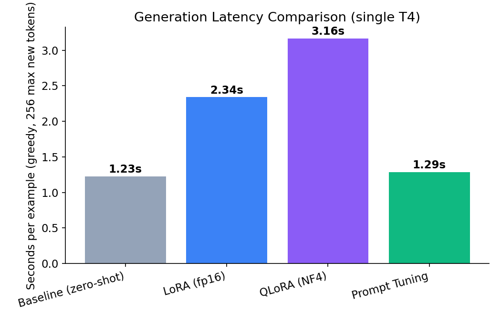
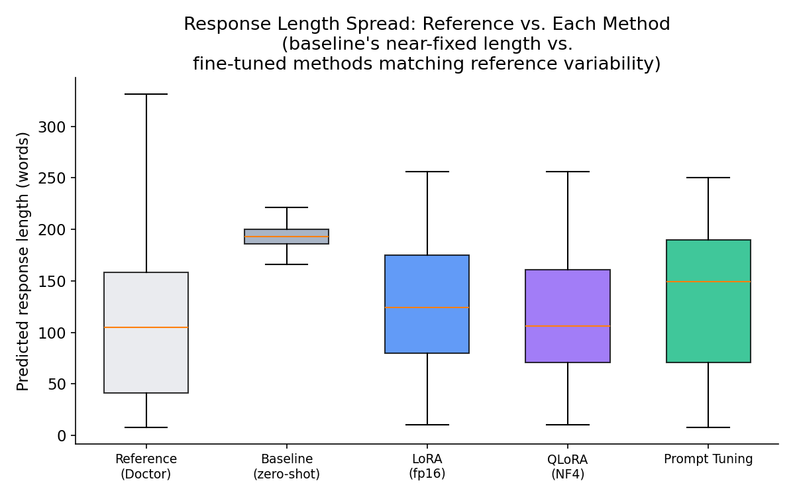
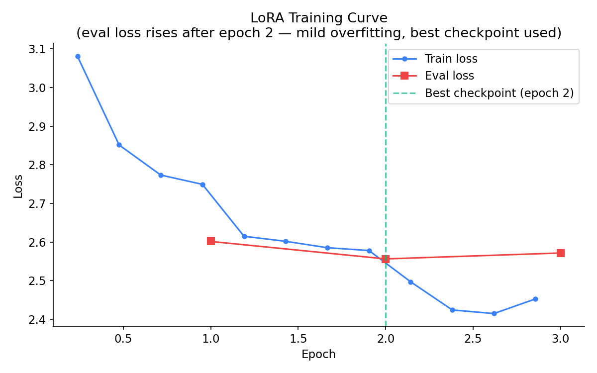
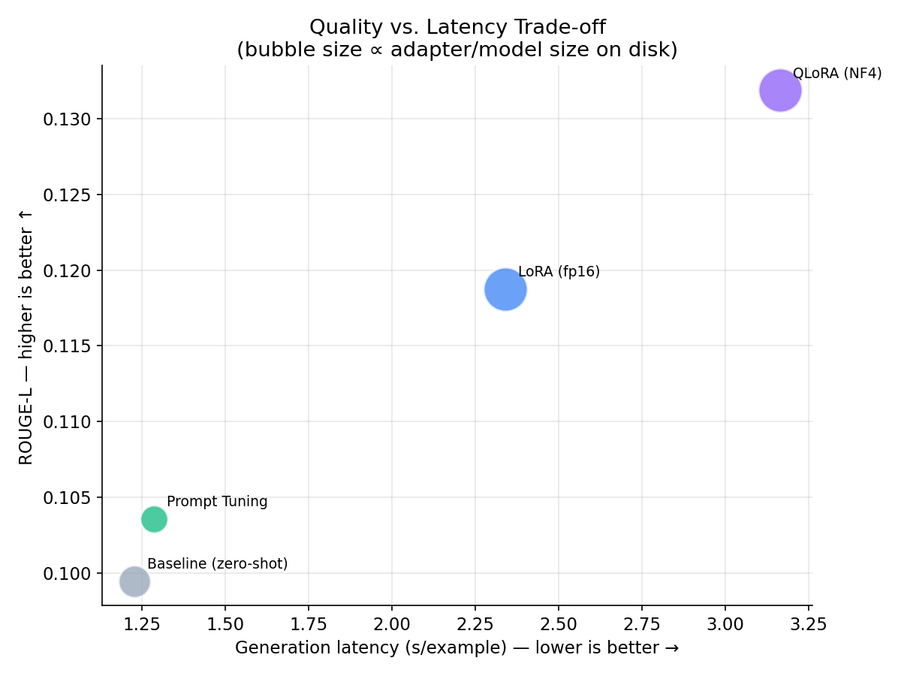
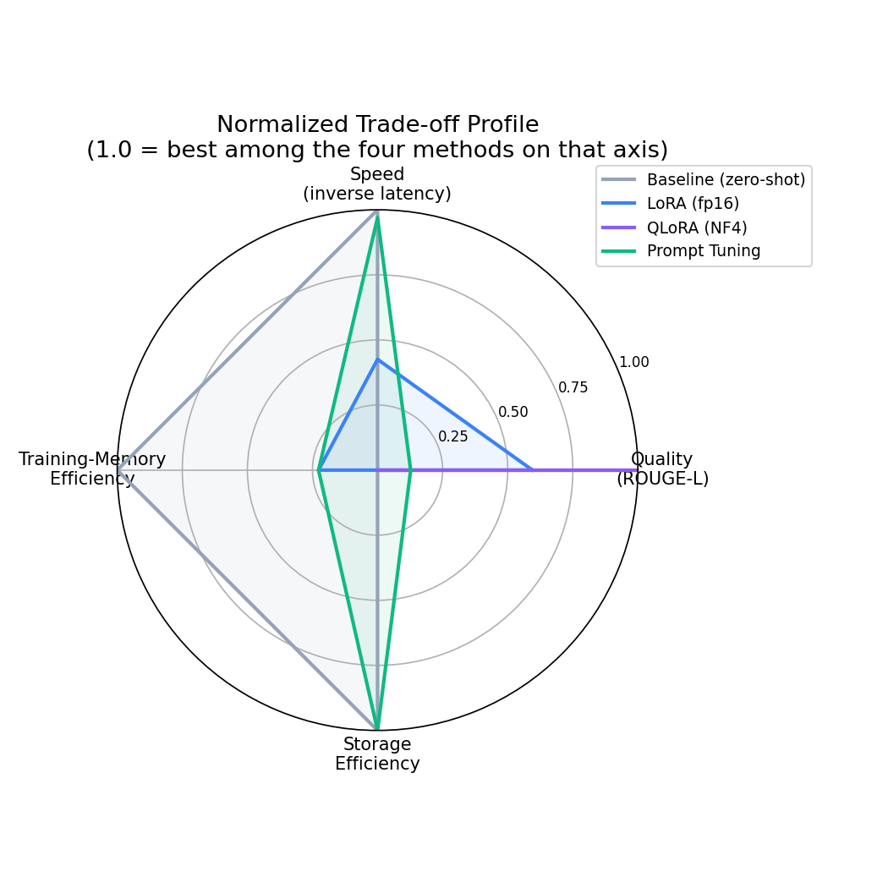

# MediGuide — Fine-Tuning an e-Doctor Chatbot with PEFT

Comparing four ways to adapt `Qwen/Qwen2.5-1.5B-Instruct` into a doctor-patient conversational
assistant: **zero-shot baseline**, **LoRA**, **QLoRA (4-bit NF4)**, and **Prompt Tuning** — same
dataset, same seed, same evaluation pipeline, all trained and evaluated on a single Kaggle T4.

> **A note on scope.** This is a learning/portfolio project run on free Kaggle T4 GPUs with a
> ~3.3K-row dataset. The numbers below are real, reproducible results from that setup — not a
> claim about how these methods perform at production scale or on larger models. Several findings
> here (e.g. QLoRA matching fp16 LoRA quality) are single-run results and are called out as such.

---

## Table of Contents

- [Problem Statement](#problem-statement)
- [Architecture](#architecture)
- [Dataset](#dataset)
- [Methods Compared](#methods-compared)
- [Results](#results)
- [Key Findings](#key-findings)
- [Trade-off Analysis](#trade-off-analysis)
- [Recommended Deployment Strategy](#recommended-deployment-strategy)
- [Repro / Environment Notes](#repro--environment-notes)
- [Known Gotchas We Hit](#known-gotchas-we-hit-so-you-dont-have-to)

---

## Problem Statement

Healthcare providers increasingly seek AI-assisted tools to deliver preliminary guidance and
triage for common medical inquiries. This project transforms an open-source, decoder-only
Transformer model into a medically-informed chatbot that responds to patient questions with
contextually appropriate, professionally worded advice — while comparing multiple PEFT
fine-tuning strategies on performance, resource utilization, and deployment feasibility.

**Goals:**
- Ingest a free-text medical question and generate a response that adheres to a professional,
  clinically-appropriate tone and includes an informational-use disclaimer.
- Compare LoRA, QLoRA, and Prompt Tuning on identical training data.
- Report ROUGE, perplexity, latency, and model size across all methods.
- Verify no patient-identifiable information is present in the dataset.

---

## Architecture

All four branches share: the same tokenizer (never modified — no `add_tokens` /
`resize_token_embeddings`), the same prompt template, the same train/val/test split, seed `8`
throughout, and fp16 compute (the T4's Turing architecture has no native bf16 tensor-core
support).

---

## Dataset

333 held-out test examples (of ~3.3K total, 80/10/10 split). Columns: `Description`, `Patient`,
`Doctor`, `Status` (severity label — used for stratified reporting only, not part of the
input/target pair).

  

  

The `Doctor` reference responses vary hugely in length (8–483 words, median 105) — some are
substantive clinical explanations, others are one-line specialist referrals ("consult a
dermatologist online"). This variability turns out to matter a lot for interpreting the results
below.

---

## Methods Compared

| Method | Trainable params | What's frozen | Base precision |
|---|---|---|---|
| **Baseline** | 0 (zero-shot) | Everything | fp16 |
| **LoRA** | ~9M (rank 16, attention + MLP) | Base model weights | fp16 |
| **QLoRA** | ~9M (rank 16, attention + MLP) | Base model weights (4-bit NF4) | 4-bit NF4 |
| **Prompt Tuning** | ~30K (20 virtual tokens × 1536 dim) | 100% of base model | fp16 |

LoRA/QLoRA target modules: `q_proj, k_proj, v_proj, o_proj, gate_proj, up_proj, down_proj`
(attention + MLP). `r=16, alpha=32, dropout=0.05`. `modules_to_save` deliberately left unset in
both — see [Known Gotchas](#known-gotchas-we-hit-so-you-dont-have-to).

---

## Results

### ROUGE Scores

  

### Perplexity (teacher-forced on reference text — lower is better)

  

### Generation Latency (single T4, greedy decoding, 256 max new tokens)

  

### Full Comparison Table

| Metric | Baseline | LoRA (fp16) | QLoRA (NF4) | Prompt Tuning |
|---|---:|---:|---:|---:|
| ROUGE-1 | 0.2104 | 0.2098 | **0.2241** | 0.1973 |
| ROUGE-2 | 0.0217 | 0.0360 | **0.0444** | 0.0244 |
| ROUGE-L | 0.0995 | 0.1188 | **0.1319** | 0.1036 |
| BLEU | 0.43 | 1.81 | **2.40** | 0.81 |
| Perplexity ↓ | 27.23 | 14.50 | 14.65 | 18.43 |
| Latency (s/example) | **1.23** | 2.34 | 3.16 | 1.29 |
| Adapter size | — | 70.5 MB | 70.5 MB | **0.12 MB** |
| Base model footprint | ~3 GB (fp16) | ~3 GB (fp16) | **~1.06 GB (NF4)** | ~3 GB (fp16) |
| Peak training GPU memory | — | not recorded¹ | 6.33 GB | 4.89 GB |
| Training wall-clock | — | not recorded¹ | 74.5 min | 42.9 min |

¹ *The LoRA notebook was run before we added explicit peak-memory/wall-clock tracking to the
later notebooks. Its numbers here are as reported at the time; re-running the notebook with the
tracking cell added would fill this gap.*

---

## Key Findings

### 1. The baseline's real problem was register, not knowledge

The zero-shot model already used mostly the right words (ROUGE-1 ≈ LoRA's) — its failure mode was
**structural**: it produced a near-fixed ~190-word, bulleted, "helpful assistant" answer to nearly
every question (std of only 18.7 words), regardless of what was actually asked. The reference
`Doctor` replies vary from 8 to 483 words depending on the question. Fine-tuning's biggest win
was teaching the model to vary response length and drop the markdown-list habit — not teaching it
new medical facts.

  

### 2. ~20% of the test set is terse referrals, and greedy decoding structurally under-serves them

19.5% of references are one-line specialist referrals ("hi for further information consult a
psychiatrist online") rather than substantive answers. On this subset, LoRA's **perplexity is
very low** (median 2.3 vs 14.7 on substantive answers) — the model clearly assigns high
probability to this register when teacher-forced — but **ROUGE-L is worse** (median 0.055 vs
0.124) because greedy decoding still walks toward the higher-probability *explanatory* mode at
each step rather than the terser referral mode. This is a decoding-strategy artifact, not a
failure to learn the domain, and it drags down aggregate ROUGE-L across all fine-tuned methods.

### 3. QLoRA matched (and by these numbers, slightly beat) fp16 LoRA on quality — with a caveat

Perplexity is nearly tied (14.65 vs 14.50); ROUGE-L, ROUGE-2, and BLEU all came in higher for
QLoRA. Given this is a single training run per method, with different micro-batch composition
(LoRA: batch 1 × accum 16; QLoRA: batch 2 × accum 8) and no repeated-seed variance analysis, this
should be read as **"QLoRA achieved comparable quality to fp16 LoRA while cutting base-model
memory by ~65%,"** not as "quantization improved quality" — that gap is well within plausible
run-to-run noise.

### 4. Prompt tuning: near-free latency and storage, but can't fix the formatting habit

Prompt tuning's generation latency (1.29s) is within 5% of the raw baseline's (1.23s) — the
frozen model does identical computation either way — and its adapter is **~600× smaller** than
LoRA/QLoRA's (0.12 MB vs 70.5 MB). But qualitative inspection shows it still reaches for numbered
lists and stock assistant hedging phrases ("I understand your concern...") that never appear in
the actual dataset. It can bias *topic and length* via the virtual tokens, but it can't suppress
the base model's ingrained formatting reflex, because that requires modifying internal
computation — exactly what LoRA/QLoRA do and prompt tuning structurally cannot.

### 5. "Parameter-efficient" ≠ "training-memory-efficient"

Prompt tuning trains ~300× fewer parameters than LoRA (30K vs ~9M) but its peak training memory
(4.89 GB) is in the same ballpark as QLoRA's (6.33 GB, at 2× the batch size) — nowhere close to a
300× reduction. The memory bottleneck during training is **activations from the frozen model's
forward pass**, which must be kept (or recomputed via checkpointing) regardless of how few
parameters actually receive gradients. Prompt tuning wins decisively on storage/deployment
footprint, not on training-time GPU memory.

### 6. The LoRA run mildly overfit after epoch 2 — and the checkpointing caught it

  

Training loss kept falling through epoch 3, but eval loss bottomed out at epoch 2 (2.556) and
ticked back up by epoch 3 (2.571) — classic overfitting on a training set of this size.
`load_best_model_at_end=True` correctly reloaded the epoch-2 checkpoint before evaluation, so the
LoRA numbers reported throughout this project reflect the epoch-2 weights, not epoch-3.

---

## Trade-off Analysis

  

  

*Note on the radar chart: with only four methods being compared, min-max normalization pushes the
worst performer on any given axis all the way to 0. QLoRA's near-flat profile (0 on three axes)
is a real reflection of it winning decisively on quality and losing on speed/storage/training
memory relative to the other three — not a charting artifact.*

**The four-way trade-off, in one paragraph:** QLoRA wins on quality and base-model memory
footprint, at the cost of the slowest inference. LoRA (fp16) is the balanced middle option — solid
quality gain, moderate cost everywhere. Prompt Tuning is nearly free on latency and storage but
can only partially close the quality gap versus the zero-shot baseline. The baseline itself is
fastest and smallest by definition, but structurally the weakest on response quality.

---

## Recommended Deployment Strategy

| Scenario | Recommended method | Why |
|---|---|---|
| Best overall quality, memory-constrained training environment | **QLoRA** | Best ROUGE-L/perplexity here, ~65% smaller base-model footprint than fp16, acceptable if inference latency isn't the binding constraint |
| Balanced default / general-purpose deployment | **LoRA (fp16)** | Comparable quality to QLoRA, faster inference, simpler serving stack (no 4-bit dequant path needed) |
| Latency-critical or edge/low-storage deployment | **Prompt Tuning** | Near-zero latency overhead vs. raw base model, adapter is trivially small to ship/swap; accept it will not fully fix response-length/formatting issues |
| Never | **Zero-shot baseline** | Structurally mismatched to this dataset's register regardless of cost — not a viable deployment option even though it's "free" |

---

## Repro / Environment Notes

- **Hardware:** Kaggle, single NVIDIA T4 (16GB). Turing architecture (compute capability 7.5) —
  no native bf16 tensor-core support, so fp16 is used throughout, not bf16.
- **Base model:** `Qwen/Qwen2.5-1.5B-Instruct`, tokenizer never modified (no `add_tokens`, no
  `resize_token_embeddings` — see gotchas below for why this matters).
- **Seed:** `8`, set for `random`, `numpy`, `torch`, and passed to `TrainingArguments` as both
  `seed` and `data_seed`, throughout every notebook.
- **Prompt template:** system message (clinical/professional/disclaimer instructions) + user turn
  (`Description` + `Patient`) → assistant turn (`Doctor`), built via
  `tokenizer.apply_chat_template`.
- **`MAX_PROMPT_LENGTH=768`, `MAX_TARGET_LENGTH=384`** for LoRA/QLoRA/Prompt Tuning training
  (raised from the baseline eval's 512 after finding it silently truncated 2/333 long `Patient`
  messages mid-sentence).
- **Notebooks:** `mediguide_baseline_evaluation.ipynb`, `mediguide_lora_finetuning.ipynb`,
  `mediguide_qlora_finetuning.ipynb`, `mediguide_prompt_tuning.ipynb` — each self-contained,
  writing `results/<method>_summary.json` and `results/<method>_predictions.csv` for
  cross-notebook comparison.

---

## Known Gotchas We Hit (So You Don't Have To)

1. **905MB adapter from a tokenizer/vocab mismatch.** Adding tokens and calling
   `resize_token_embeddings` forces `embed_tokens`/`lm_head` into PEFT's `modules_to_save`, which
   saves those full matrices (not low-rank deltas) into the adapter checkpoint. Fix: never modify
   the tokenizer if the base tokenizer already covers what you need (it did here).
2. **`torchao` version mismatch breaking `get_peft_model`.** Kaggle's base image ships a
   `torchao` older than what recent `peft` versions expect, even when quantization isn't in use.
   Fix: `pip uninstall -y torchao` before importing `peft`.
3. **CUDA OOM during LoRA backward pass.** Qwen2.5's ~152K vocab makes the fp32-upcast
   cross-entropy logits tensor large at long sequence lengths. Fix: `per_device_train_batch_size=1`
   with higher gradient accumulation, `PYTORCH_CUDA_ALLOC_CONF=expandable_segments:True` set
   *before* `torch` touches CUDA, and trimming `MAX_TARGET_LENGTH`.
4. **`bitsandbytes` 4-bit layers + `Trainer`'s automatic `DataParallel` → illegal memory access.**
   On a 2-GPU Kaggle session, `Trainer` auto-wraps in `nn.DataParallel` whenever
   `torch.cuda.device_count() > 1`, which is not safe with quantized layers. Fix:
   `os.environ["CUDA_VISIBLE_DEVICES"] = "0"` set before `import torch`, so only one GPU is ever
   visible to the process.
5. **Kaggle's browser-idle disconnect on long training runs.** The "continue editing?" prompt is
   based on browser interaction, not job liveness. Fix: use **Save Version → Save & Run All
   (Commit)** to run as a background batch job instead of an interactive session.
